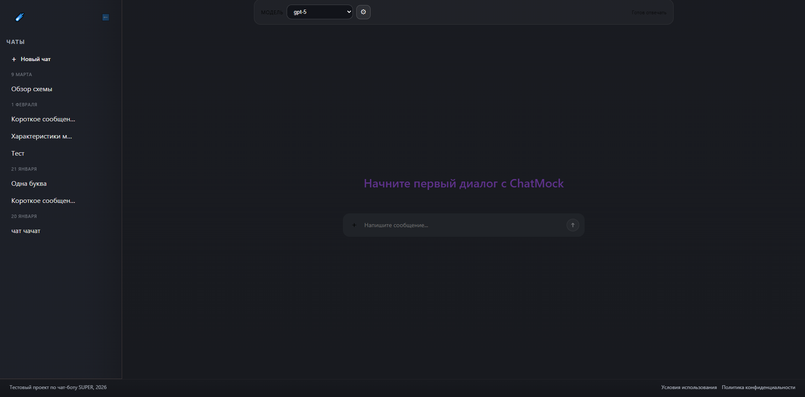
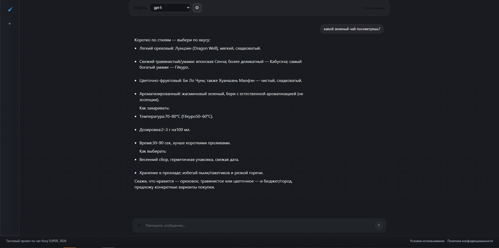
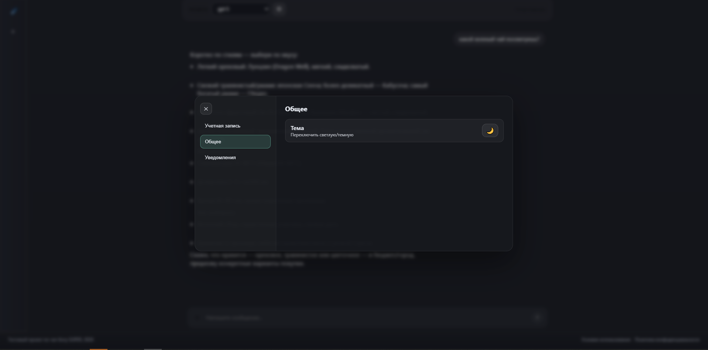

# 🤖 Chatbot + ChatMock

Веб-приложение с интерфейсом чата и локальным backend на базе ChatMock.  
UI отправляет сообщения в ChatMock, получает потоковый ответ модели, показывает его токен за токеном, подгружает список моделей и автоматически запрашивает название для нового чата после первого ответа ассистента.

---

## 🚀 Быстрый старт

### 1. Установка зависимостей фронтенда

```bash
npm install
```

### 2. Настройка доступа к ChatMock

Открой файл `src/config/credentials.js` и заполни:

- `baseUrl`
- `apiKey` при необходимости
- `login`
- `password`

По умолчанию UI ожидает ChatMock на адресе `http://127.0.0.1:8000`.

### 3. Запуск ChatMock

```bash
cd ChatMock
python chatmock.py login
python chatmock.py serve
```

### 4. Запуск интерфейса

В отдельном терминале из корня проекта:

```bash
npm run dev
```

---

## ✨ Функциональность

### 💬 Работа с сообщениями

- Отправка сообщений в активный чат
- Потоковый ответ ассистента через ChatMock
- Остановка генерации во время стриминга
- Поддержка markdown-рендеринга в ответах

### 🧠 Интеграция с моделями

- Загрузка списка моделей через `/v1/models`
- Выбор модели в верхней панели интерфейса
- Использование выбранной модели для ответа и генерации названия чата

### 🗂 Управление чатами

- Создание нового чата
- Переключение между чатами
- Переименование чатов
- Закрепление чатов
- Удаление чата с возможностью отмены

### 🏷 Генерация названия чата

- После первого ответа ассистента UI может запросить короткое название чата
- Название генерируется через ChatMock на основе истории сообщений
- Внутренние `<think>`-блоки очищаются перед сохранением

### ⚙️ Интерфейс

- Боковая панель со списком чатов
- Экран пустого состояния для нового диалога
- Модальное окно настроек
- Переключение темы

---

## 🔌 Как это работает

1. Пользователь вводит сообщение в UI.
2. `useChatFlow` добавляет сообщение в текущий чат и создаёт placeholder ответа ассистента.
3. `chatMockClient` отправляет историю сообщений в ChatMock через `/v1/chat/completions`.
4. Ответ приходит потоково, UI обновляется по мере поступления токенов.
5. После завершения стрима при необходимости запрашивается название чата.

---

## 🛠 Стек технологий

- React
- Vite
- JavaScript
- CSS3
- Fetch API
- Streaming API (`ReadableStream`, `TextDecoder`)
- ChatMock

---

## 📁 Структура проекта

```text
/
├── ChatMock/                # Локальный backend для OpenAI-compatible API
│   ├── chatmock/            # Основная Python-логика ChatMock
│   ├── docker/              # Docker-скрипты и entrypoint
│   ├── scripts/             # Вспомогательные скрипты
│   ├── chatmock.py          # Точка входа backend
│   ├── pyproject.toml       # Python-конфигурация проекта
│   └── README.md            # Документация ChatMock
├── public/
│   └── vite.svg             # Статический asset Vite
├── src/
│   ├── components/
│   │   ├── Chat.jsx         # Основная область чата
│   │   ├── EmptyState.jsx   # Экран пустого состояния
│   │   ├── Footer.jsx       # Нижняя панель
│   │   ├── Input.jsx        # Поле ввода и кнопки действий
│   │   ├── Message.jsx      # Отрисовка одного сообщения
│   │   └── Sidebar.jsx      # Список чатов и боковая панель
│   ├── config/
│   │   └── credentials.js   # Настройки доступа к ChatMock
│   ├── hooks/
│   │   ├── useChatFlow.js   # Логика отправки, стриминга и title generation
│   │   └── useChats.js      # Локальный store чатов и сообщений
│   ├── services/
│   │   └── chatMockClient.js # Клиент для запросов к ChatMock
│   ├── styles/
│   │   ├── app.css
│   │   ├── chat.css
│   │   ├── emptyState.css
│   │   ├── footer.css
│   │   ├── input.css
│   │   ├── message.css
│   │   └── sidebar.css
│   ├── utils/
│   │   └── markdown.js      # Markdown-парсинг и рендеринг
│   ├── App.jsx              # Корневой компонент приложения
│   └── main.jsx             # Точка входа фронтенда
├── index.html
├── package.json
├── vite.config.js
└── README.md
```

---

## 📝 Примечания

- UI ожидает, что ChatMock уже запущен локально.
- Стриминг ответа, список моделей и генерация названий завязаны на ChatMock.
- Если захочешь, можно отдельно добавить в README скриншоты интерфейса в секцию предпросмотра.
